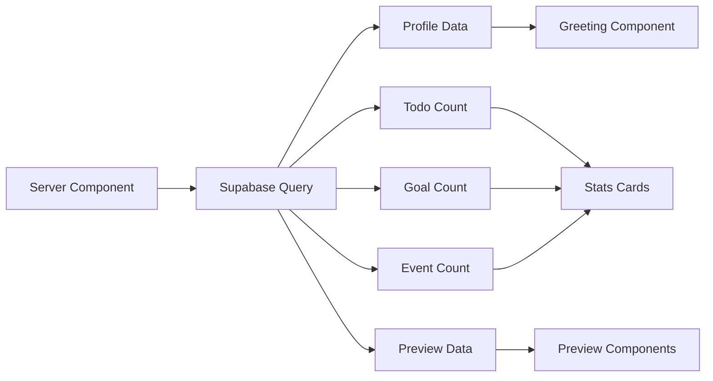

# Design Document: Starterpack IT Student

## Overview

Starterpack IT Student is a mobile-first web application built with Next.js 16 App Router and Supabase that provides high school students with a comprehensive suite of academic management tools. The application enforces a mobile-only viewport (max-width: 430px) and implements a fixed design system with a curated color palette and bottom navigation interface.

### Technology Stack

- **Frontend Framework**: Next.js 16 with App Router
- **Backend**: Supabase (PostgreSQL database, authentication, Row Level Security)
- **Authentication**: Google OAuth via Supabase Auth
- **UI Components**: Custom components with Lucide React icons
- **Form Management**: React Hook Form with Zod validation
- **Date Handling**: date-fns for parsing and formatting
- **Calendar**: React DayPicker for monthly calendar view
- **Notifications**: React Hot Toast for user feedback
- **Styling**: Tailwind CSS with custom design tokens

### Key Architectural Principles

1. **Server-First Architecture**: Leverage Server Components for data fetching and Server Actions for mutations
2. **Mobile-Only Design**: Enforce 430px maximum width with fixed bottom navigation
3. **Security by Default**: Row Level Security (RLS) policies ensure data isolation per user
4. **Optimistic UI Updates**: Checkbox interactions update immediately with background synchronization
5. **Progressive Enhancement**: Forms work without JavaScript through Server Actions
6. **Type Safety**: TypeScript throughout with Zod schema validation

## Architecture

### High-Level System Architecture

```mermaid
graph TB
    subgraph "Client Browser"
        UI[React UI Components]
        SC[Server Components]
        CC[Client Components]
    end

    subgraph "Next.js 16 App Router"
        MW[Middleware]
        SA[Server Actions]
        API[API Routes]
    end

    subgraph "Supabase"
        AUTH[Supabase Auth]
        DB[(PostgreSQL + RLS)]
        STORAGE[Storage]
    end

    UI --> SC
    UI --> CC
    CC --> SA
    SC --> DB
    SA --> DB
    MW --> AUTH
    API --> AUTH
    AUTH --> DB

    style UI fill:#F5F0E8
    style SC fill:#617891
    style CC fill:#D5B893
    style SA fill:#6F4D38
    style DB fill:#25344F
```



### Application Structure

```
app/
├── (auth)/                    # Authentication route group
│   ├── login/
│   │   └── page.tsx          # Login page with Google OAuth
│   └── auth/
│       └── callback/
│           └── route.ts      # OAuth callback handler
│
├── (app)/                     # Protected application routes
│   ├── layout.tsx            # App layout with bottom navigation
│   ├── page.tsx              # Home dashboard
│   ├── calendar/
│   │   └── page.tsx          # Academic calendar
│   ├── tasks/
│   │   └── page.tsx          # To-do list
│   ├── goals/
│   │   └── page.tsx          # Goals tracker
│   └── more/
│       ├── page.tsx          # More menu
│       ├── playlists/
│       │   └── page.tsx      # Study playlists
│       └── essentials/
│           └── page.tsx      # School essentials
│
├── actions/                   # Server Actions
│   ├── auth.ts               # Authentication actions
│   ├── calendar.ts           # Calendar CRUD
│   ├── todos.ts              # Todo CRUD
│   ├── goals.ts              # Goals CRUD
│   ├── playlists.ts          # Playlists CRUD
│   └── essentials.ts         # Essentials CRUD
│
├── components/                # Reusable UI components
│   ├── ui/
│   │   ├── Modal.tsx         # Bottom sheet modal
│   │   ├── EmptyState.tsx    # Empty state component
│   │   ├── PageHeader.tsx    # Page header
│   │   ├── Card.tsx          # Card component
│   │   └── Button.tsx        # Button component
│   ├── BottomNav.tsx         # Bottom navigation
│   └── forms/
│       ├── CalendarEventForm.tsx
│       ├── TodoForm.tsx
│       ├── GoalForm.tsx
│       ├── PlaylistForm.tsx
│       └── EssentialForm.tsx
│
├── lib/
│   ├── supabase/
│   │   ├── client.ts         # Supabase client (browser)
│   │   ├── server.ts         # Supabase client (server)
│   │   └── middleware.ts     # Supabase middleware helper
│   ├── validations/          # Zod schemas
│   │   ├── calendar.ts
│   │   ├── todo.ts
│   │   ├── goal.ts
│   │   ├── playlist.ts
│   │   └── essential.ts
│   └── utils.ts              # Utility functions
│
├── types/
│   └── database.types.ts     # Supabase generated types
│
├── middleware.ts              # Auth middleware
├── layout.tsx                 # Root layout
└── globals.css                # Global styles
```

### Route Groups

Next.js 16 route groups organize the application into logical sections:

1. **(auth)**: Unauthenticated routes for login and OAuth callback
2. **(app)**: Protected routes requiring authentication, wrapped with bottom navigation

## Components and Interfaces

### Core UI Components

#### 1. Modal Component (Bottom Sheet)

A reusable modal that slides up from the bottom of the screen for forms and detail views.

```typescript
// components/ui/Modal.tsx
'use client'

import { X } from 'lucide-react'
import { useEffect } from 'react'

interface ModalProps {
  isOpen: boolean
  onClose: () => void
  title: string
  children: React.ReactNode
}

export function Modal({ isOpen, onClose, title, children }: ModalProps) {
  useEffect(() => {
    if (isOpen) {
      document.body.style.overflow = 'hidden'
    } else {
      document.body.style.overflow = 'unset'
    }
    return () => {
      document.body.style.overflow = 'unset'
    }
  }, [isOpen])

  if (!isOpen) return null

  return (
    <div className="fixed inset-0 z-50 flex items-end justify-center">
      <div
        className="absolute inset-0 bg-black/50"
        onClick={onClose}
      />
      <div className="relative w-full max-w-[430px] bg-cream rounded-t-[20px] p-6 animate-slide-up">
        <div className="flex items-center justify-between mb-4">
          <h2 className="text-xl font-playfair text-space-cadet">{title}</h2>
          <button onClick={onClose} className="text-slate-gray">
            <X size={24} />
          </button>
        </div>
        {children}
      </div>
    </div>
  )
}
```

#### 2. EmptyState Component

Displays helpful messages when lists are empty.

```typescript
// components/ui/EmptyState.tsx
import { LucideIcon } from 'lucide-react'

interface EmptyStateProps {
  icon: LucideIcon
  title: string
  description: string
  action?: {
    label: string
    onClick: () => void
  }
}

export function EmptyState({ icon: Icon, title, description, action }: EmptyStateProps) {
  return (
    <div className="flex flex-col items-center justify-center py-12 px-6 text-center">
      <Icon size={48} className="text-slate-gray mb-4" />
      <h3 className="text-lg font-playfair text-space-cadet mb-2">{title}</h3>
      <p className="text-sm text-slate-gray mb-6">{description}</p>
      {action && (
        <button
          onClick={action.onClick}
          className="px-6 py-2 bg-space-cadet text-cream rounded-[10px] font-medium"
        >
          {action.label}
        </button>
      )}
    </div>
  )
}
```

#### 3. PageHeader Component

Consistent page title component.

```typescript
// components/ui/PageHeader.tsx
interface PageHeaderProps {
  title: string
  action?: {
    label: string
    onClick: () => void
  }
}

export function PageHeader({ title, action }: PageHeaderProps) {
  return (
    <div className="flex items-center justify-between mb-6">
      <h1 className="text-2xl font-playfair text-space-cadet">{title}</h1>
      {action && (
        <button
          onClick={action.onClick}
          className="px-4 py-2 bg-space-cadet text-cream rounded-[10px] text-sm font-medium"
        >
          {action.label}
        </button>
      )}
    </div>
  )
}
```

#### 4. Card Component

Standard card with 14px border radius.

```typescript
// components/ui/Card.tsx
import { ReactNode } from 'react'

interface CardProps {
  children: ReactNode
  className?: string
  onClick?: () => void
}

export function Card({ children, className = '', onClick }: CardProps) {
  return (
    <div
      className={`bg-white rounded-[14px] p-4 shadow-sm ${className}`}
      onClick={onClick}
    >
      {children}
    </div>
  )
}
```

#### 5. Button Component

Reusable button with loading states.

```typescript
// components/ui/Button.tsx
import { Loader2 } from 'lucide-react'

interface ButtonProps {
  children: React.ReactNode
  onClick?: () => void
  type?: 'button' | 'submit' | 'reset'
  variant?: 'primary' | 'secondary' | 'danger'
  loading?: boolean
  disabled?: boolean
  className?: string
}

export function Button({
  children,
  onClick,
  type = 'button',
  variant = 'primary',
  loading = false,
  disabled = false,
  className = '',
}: ButtonProps) {
  const baseStyles = 'px-6 py-3 rounded-[10px] font-medium transition-colors disabled:opacity-50'

  const variantStyles = {
    primary: 'bg-space-cadet text-cream hover:bg-space-cadet/90',
    secondary: 'bg-slate-gray text-cream hover:bg-slate-gray/90',
    danger: 'bg-caput text-cream hover:bg-caput/90',
  }

  return (
    <button
      type={type}
      onClick={onClick}
      disabled={disabled || loading}
      className={`${baseStyles} ${variantStyles[variant]} ${className}`}
    >
      {loading ? (
        <span className="flex items-center justify-center">
          <Loader2 className="animate-spin mr-2" size={16} />
          Loading...
        </span>
      ) : (
        children
      )}
    </button>
  )
}
```

### Bottom Navigation Component

```typescript
// components/BottomNav.tsx
'use client'

import Link from 'next/link'
import { usePathname } from 'next/navigation'
import { Home, Calendar, CheckSquare, Target, MoreHorizontal } from 'lucide-react'

const navItems = [
  { href: '/', icon: Home, label: 'Home' },
  { href: '/calendar', icon: Calendar, label: 'Calendar' },
  { href: '/tasks', icon: CheckSquare, label: 'Tasks' },
  { href: '/goals', icon: Target, label: 'Goals' },
  { href: '/more', icon: MoreHorizontal, label: 'More' },
]

export function BottomNav() {
  const pathname = usePathname()

  return (
    <nav className="fixed bottom-0 left-0 right-0 bg-white border-t border-slate-gray/20 z-40">
      <div className="max-w-[430px] mx-auto flex justify-around items-center h-16">
        {navItems.map(({ href, icon: Icon, label }) => {
          const isActive = pathname === href
          return (
            <Link
              key={href}
              href={href}
              className={`flex flex-col items-center justify-center flex-1 h-full transition-colors ${
                isActive ? 'text-space-cadet' : 'text-slate-gray'
              }`}
            >
              <Icon size={24} />
              <span className="text-xs mt-1 font-jetbrains">{label}</span>
            </Link>
          )
        })}
      </div>
    </nav>
  )
}
```

## Data Models

### Database Schema

The application uses Supabase PostgreSQL with the following schema:

```sql
-- Enable UUID extension
CREATE EXTENSION IF NOT EXISTS "uuid-ossp";

-- Profiles table (extends Supabase auth.users)
CREATE TABLE profiles (
  id UUID PRIMARY KEY REFERENCES auth.users(id) ON DELETE CASCADE,
  email TEXT NOT NULL,
  full_name TEXT,
  avatar_url TEXT,
  created_at TIMESTAMPTZ DEFAULT NOW(),
  updated_at TIMESTAMPTZ DEFAULT NOW()
);

-- Calendar events table
CREATE TABLE calendar_events (
  id UUID PRIMARY KEY DEFAULT uuid_generate_v4(),
  user_id UUID NOT NULL REFERENCES profiles(id) ON DELETE CASCADE,
  title TEXT NOT NULL,
  date DATE NOT NULL,
  notes TEXT,
  color TEXT NOT NULL CHECK (color IN ('exam', 'deadline', 'event', 'reminder')),
  created_at TIMESTAMPTZ DEFAULT NOW(),
  updated_at TIMESTAMPTZ DEFAULT NOW()
);

-- Todos table
CREATE TABLE todos (
  id UUID PRIMARY KEY DEFAULT uuid_generate_v4(),
  user_id UUID NOT NULL REFERENCES profiles(id) ON DELETE CASCADE,
  title TEXT NOT NULL,
  completed BOOLEAN DEFAULT FALSE,
  tag TEXT NOT NULL CHECK (tag IN ('math', 'english', 'science', 'ipa', 'ips', 'general')),
  created_at TIMESTAMPTZ DEFAULT NOW(),
  updated_at TIMESTAMPTZ DEFAULT NOW()
);

-- Goals table
CREATE TABLE goals (
  id UUID PRIMARY KEY DEFAULT uuid_generate_v4(),
  user_id UUID NOT NULL REFERENCES profiles(id) ON DELETE CASCADE,
  title TEXT NOT NULL,
  created_at TIMESTAMPTZ DEFAULT NOW(),
  updated_at TIMESTAMPTZ DEFAULT NOW()
);

-- Goal steps table
CREATE TABLE goal_steps (
  id UUID PRIMARY KEY DEFAULT uuid_generate_v4(),
  goal_id UUID NOT NULL REFERENCES goals(id) ON DELETE CASCADE,
  title TEXT NOT NULL,
  completed BOOLEAN DEFAULT FALSE,
  created_at TIMESTAMPTZ DEFAULT NOW(),
  updated_at TIMESTAMPTZ DEFAULT NOW()
);

-- Playlists table
CREATE TABLE playlists (
  id UUID PRIMARY KEY DEFAULT uuid_generate_v4(),
  user_id UUID NOT NULL REFERENCES profiles(id) ON DELETE CASCADE,
  name TEXT NOT NULL,
  description TEXT,
  url TEXT NOT NULL,
  created_at TIMESTAMPTZ DEFAULT NOW(),
  updated_at TIMESTAMPTZ DEFAULT NOW()
);

-- Essentials table
CREATE TABLE essentials (
  id UUID PRIMARY KEY DEFAULT uuid_generate_v4(),
  user_id UUID NOT NULL REFERENCES profiles(id) ON DELETE CASCADE,
  name TEXT NOT NULL,
  description TEXT,
  icon TEXT NOT NULL CHECK (icon IN ('Laptop', 'Headphones', 'BookOpen', 'Pen', 'Backpack', 'Watch', 'Glasses', 'Coffee', 'Package', 'Star')),
  category TEXT NOT NULL CHECK (category IN ('gadget', 'stationery', 'fashion', 'book', 'general')),
  created_at TIMESTAMPTZ DEFAULT NOW(),
  updated_at TIMESTAMPTZ DEFAULT NOW()
);

-- Indexes for performance
CREATE INDEX idx_calendar_events_user_date ON calendar_events(user_id, date);
CREATE INDEX idx_todos_user_completed ON todos(user_id, completed);
CREATE INDEX idx_goals_user ON goals(user_id);
CREATE INDEX idx_goal_steps_goal ON goal_steps(goal_id);
CREATE INDEX idx_playlists_user ON playlists(user_id);
CREATE INDEX idx_essentials_user ON essentials(user_id);

-- Row Level Security (RLS) Policies
ALTER TABLE profiles ENABLE ROW LEVEL SECURITY;
ALTER TABLE calendar_events ENABLE ROW LEVEL SECURITY;
ALTER TABLE todos ENABLE ROW LEVEL SECURITY;
ALTER TABLE goals ENABLE ROW LEVEL SECURITY;
ALTER TABLE goal_steps ENABLE ROW LEVEL SECURITY;
ALTER TABLE playlists ENABLE ROW LEVEL SECURITY;
ALTER TABLE essentials ENABLE ROW LEVEL SECURITY;

-- Profiles policies
CREATE POLICY "Users can view own profile" ON profiles
  FOR SELECT USING (auth.uid() = id);
CREATE POLICY "Users can update own profile" ON profiles
  FOR UPDATE USING (auth.uid() = id);

-- Calendar events policies
CREATE POLICY "Users can view own calendar events" ON calendar_events
  FOR SELECT USING (auth.uid() = user_id);
CREATE POLICY "Users can create own calendar events" ON calendar_events
  FOR INSERT WITH CHECK (auth.uid() = user_id);
CREATE POLICY "Users can update own calendar events" ON calendar_events
  FOR UPDATE USING (auth.uid() = user_id);
CREATE POLICY "Users can delete own calendar events" ON calendar_events
  FOR DELETE USING (auth.uid() = user_id);

-- Todos policies
CREATE POLICY "Users can view own todos" ON todos
  FOR SELECT USING (auth.uid() = user_id);
CREATE POLICY "Users can create own todos" ON todos
  FOR INSERT WITH CHECK (auth.uid() = user_id);
CREATE POLICY "Users can update own todos" ON todos
  FOR UPDATE USING (auth.uid() = user_id);
CREATE POLICY "Users can delete own todos" ON todos
  FOR DELETE USING (auth.uid() = user_id);

-- Goals policies
CREATE POLICY "Users can view own goals" ON goals
  FOR SELECT USING (auth.uid() = user_id);
CREATE POLICY "Users can create own goals" ON goals
  FOR INSERT WITH CHECK (auth.uid() = user_id);
CREATE POLICY "Users can update own goals" ON goals
  FOR UPDATE USING (auth.uid() = user_id);
CREATE POLICY "Users can delete own goals" ON goals
  FOR DELETE USING (auth.uid() = user_id);

-- Goal steps policies (inherit from parent goal)
CREATE POLICY "Users can view goal steps" ON goal_steps
  FOR SELECT USING (
    EXISTS (
      SELECT 1 FROM goals
      WHERE goals.id = goal_steps.goal_id
      AND goals.user_id = auth.uid()
    )
  );
CREATE POLICY "Users can create goal steps" ON goal_steps
  FOR INSERT WITH CHECK (
    EXISTS (
      SELECT 1 FROM goals
      WHERE goals.id = goal_steps.goal_id
      AND goals.user_id = auth.uid()
    )
  );
CREATE POLICY "Users can update goal steps" ON goal_steps
  FOR UPDATE USING (
    EXISTS (
      SELECT 1 FROM goals
      WHERE goals.id = goal_steps.goal_id
      AND goals.user_id = auth.uid()
    )
  );
CREATE POLICY "Users can delete goal steps" ON goal_steps
  FOR DELETE USING (
    EXISTS (
      SELECT 1 FROM goals
      WHERE goals.id = goal_steps.goal_id
      AND goals.user_id = auth.uid()
    )
  );

-- Playlists policies
CREATE POLICY "Users can view own playlists" ON playlists
  FOR SELECT USING (auth.uid() = user_id);
CREATE POLICY "Users can create own playlists" ON playlists
  FOR INSERT WITH CHECK (auth.uid() = user_id);
CREATE POLICY "Users can update own playlists" ON playlists
  FOR UPDATE USING (auth.uid() = user_id);
CREATE POLICY "Users can delete own playlists" ON playlists
  FOR DELETE USING (auth.uid() = user_id);

-- Essentials policies
CREATE POLICY "Users can view own essentials" ON essentials
  FOR SELECT USING (auth.uid() = user_id);
CREATE POLICY "Users can create own essentials" ON essentials
  FOR INSERT WITH CHECK (auth.uid() = user_id);
CREATE POLICY "Users can update own essentials" ON essentials
  FOR UPDATE USING (auth.uid() = user_id);
CREATE POLICY "Users can delete own essentials" ON essentials
  FOR DELETE USING (auth.uid() = user_id);

-- Function to automatically update updated_at timestamp
CREATE OR REPLACE FUNCTION update_updated_at_column()
RETURNS TRIGGER AS $$
BEGIN
  NEW.updated_at = NOW();
  RETURN NEW;
END;
$$ LANGUAGE plpgsql;

-- Triggers for updated_at
CREATE TRIGGER update_profiles_updated_at BEFORE UPDATE ON profiles
  FOR EACH ROW EXECUTE FUNCTION update_updated_at_column();
CREATE TRIGGER update_calendar_events_updated_at BEFORE UPDATE ON calendar_events
  FOR EACH ROW EXECUTE FUNCTION update_updated_at_column();
CREATE TRIGGER update_todos_updated_at BEFORE UPDATE ON todos
  FOR EACH ROW EXECUTE FUNCTION update_updated_at_column();
CREATE TRIGGER update_goals_updated_at BEFORE UPDATE ON goals
  FOR EACH ROW EXECUTE FUNCTION update_updated_at_column();
CREATE TRIGGER update_goal_steps_updated_at BEFORE UPDATE ON goal_steps
  FOR EACH ROW EXECUTE FUNCTION update_updated_at_column();
CREATE TRIGGER update_playlists_updated_at BEFORE UPDATE ON playlists
  FOR EACH ROW EXECUTE FUNCTION update_updated_at_column();
CREATE TRIGGER update_essentials_updated_at BEFORE UPDATE ON essentials
  FOR EACH ROW EXECUTE FUNCTION update_updated_at_column();
```

### TypeScript Types

```typescript
// types/database.types.ts
export type EventColor = 'exam' | 'deadline' | 'event' | 'reminder'
export type TodoTag = 'math' | 'english' | 'science' | 'ipa' | 'ips' | 'general'
export type EssentialIcon =
  | 'Laptop'
  | 'Headphones'
  | 'BookOpen'
  | 'Pen'
  | 'Backpack'
  | 'Watch'
  | 'Glasses'
  | 'Coffee'
  | 'Package'
  | 'Star'
export type EssentialCategory = 'gadget' | 'stationery' | 'fashion' | 'book' | 'general'

export interface Profile {
  id: string
  email: string
  full_name: string | null
  avatar_url: string | null
  created_at: string
  updated_at: string
}

export interface CalendarEvent {
  id: string
  user_id: string
  title: string
  date: string
  notes: string | null
  color: EventColor
  created_at: string
  updated_at: string
}

export interface Todo {
  id: string
  user_id: string
  title: string
  completed: boolean
  tag: TodoTag
  created_at: string
  updated_at: string
}

export interface Goal {
  id: string
  user_id: string
  title: string
  created_at: string
  updated_at: string
}

export interface GoalStep {
  id: string
  goal_id: string
  title: string
  completed: boolean
  created_at: string
  updated_at: string
}

export interface Playlist {
  id: string
  user_id: string
  name: string
  description: string | null
  url: string
  created_at: string
  updated_at: string
}

export interface Essential {
  id: string
  user_id: string
  name: string
  description: string | null
  icon: EssentialIcon
  category: EssentialCategory
  created_at: string
  updated_at: string
}

// Extended types with relations
export interface GoalWithSteps extends Goal {
  steps: GoalStep[]
  progress: number
}
```

### Validation Schemas

```typescript
// lib/validations/calendar.ts
import { z } from 'zod'

export const calendarEventSchema = z.object({
  title: z.string().min(1, 'Title is required').max(100, 'Title too long'),
  date: z.string().refine((val) => !isNaN(Date.parse(val)), 'Invalid date'),
  notes: z.string().max(500, 'Notes too long').optional(),
  color: z.enum(['exam', 'deadline', 'event', 'reminder']),
})

export type CalendarEventInput = z.infer<typeof calendarEventSchema>

// lib/validations/todo.ts
import { z } from 'zod'

export const todoSchema = z.object({
  title: z.string().min(1, 'Title is required').max(200, 'Title too long'),
  tag: z.enum(['math', 'english', 'science', 'ipa', 'ips', 'general']),
})

export type TodoInput = z.infer<typeof todoSchema>

// lib/validations/goal.ts
import { z } from 'zod'

export const goalSchema = z.object({
  title: z.string().min(1, 'Title is required').max(200, 'Title too long'),
})

export const goalStepSchema = z.object({
  title: z.string().min(1, 'Title is required').max(200, 'Title too long'),
  goal_id: z.string().uuid('Invalid goal ID'),
})

export type GoalInput = z.infer<typeof goalSchema>
export type GoalStepInput = z.infer<typeof goalStepSchema>

// lib/validations/playlist.ts
import { z } from 'zod'

export const playlistSchema = z.object({
  name: z.string().min(1, 'Name is required').max(100, 'Name too long'),
  description: z.string().max(500, 'Description too long').optional(),
  url: z
    .string()
    .url('Invalid URL')
    .refine((url) => url.includes('open.spotify.com'), 'Must be a Spotify URL'),
})

export type PlaylistInput = z.infer<typeof playlistSchema>

// lib/validations/essential.ts
import { z } from 'zod'

export const essentialSchema = z.object({
  name: z.string().min(1, 'Name is required').max(100, 'Name too long'),
  description: z.string().max(500, 'Description too long').optional(),
  icon: z.enum([
    'Laptop',
    'Headphones',
    'BookOpen',
    'Pen',
    'Backpack',
    'Watch',
    'Glasses',
    'Coffee',
    'Package',
    'Star',
  ]),
  category: z.enum(['gadget', 'stationery', 'fashion', 'book', 'general']),
})

export type EssentialInput = z.infer<typeof essentialSchema>
```

## Authentication Flow

### Google OAuth Implementation

```typescript
// lib/supabase/client.ts
import { createBrowserClient } from '@supabase/ssr'

export function createClient() {
  return createBrowserClient(
    process.env.NEXT_PUBLIC_SUPABASE_URL!,
    process.env.NEXT_PUBLIC_SUPABASE_ANON_KEY!
  )
}

// lib/supabase/server.ts
import { createServerClient } from '@supabase/ssr'
import { cookies } from 'next/headers'

export async function createClient() {
  const cookieStore = await cookies()

  return createServerClient(
    process.env.NEXT_PUBLIC_SUPABASE_URL!,
    process.env.NEXT_PUBLIC_SUPABASE_ANON_KEY!,
    {
      cookies: {
        getAll() {
          return cookieStore.getAll()
        },
        setAll(cookiesToSet) {
          try {
            cookiesToSet.forEach(({ name, value, options }) =>
              cookieStore.set(name, value, options)
            )
          } catch {
            // Server Component - ignore
          }
        },
      },
    }
  )
}

// middleware.ts
import { createServerClient } from '@supabase/ssr'
import { NextResponse, type NextRequest } from 'next/server'

export async function middleware(request: NextRequest) {
  let supabaseResponse = NextResponse.next({
    request,
  })

  const supabase = createServerClient(
    process.env.NEXT_PUBLIC_SUPABASE_URL!,
    process.env.NEXT_PUBLIC_SUPABASE_ANON_KEY!,
    {
      cookies: {
        getAll() {
          return request.cookies.getAll()
        },
        setAll(cookiesToSet) {
          cookiesToSet.forEach(({ name, value, options }) => request.cookies.set(name, value))
          supabaseResponse = NextResponse.next({
            request,
          })
          cookiesToSet.forEach(({ name, value, options }) =>
            supabaseResponse.cookies.set(name, value, options)
          )
        },
      },
    }
  )

  const {
    data: { user },
  } = await supabase.auth.getUser()

  // Redirect to login if not authenticated and trying to access protected routes
  if (!user && !request.nextUrl.pathname.startsWith('/login') && !request.nextUrl.pathname.startsWith('/auth')) {
    const url = request.nextUrl.clone()
    url.pathname = '/login'
    return NextResponse.redirect(url)
  }

  // Redirect to home if authenticated and trying to access login
  if (user && request.nextUrl.pathname.startsWith('/login')) {
    const url = request.nextUrl.clone()
    url.pathname = '/'
    return NextResponse.redirect(url)
  }

  return supabaseResponse
}

export const config = {
  matcher: [
    '/((?!_next/static|_next/image|favicon.ico|.*\\.(?:svg|png|jpg|jpeg|gif|webp)$).*)',
  ],
}

// app/(auth)/login/page.tsx
import { createClient } from '@/lib/supabase/server'
import { redirect } from 'next/navigation'
import { LoginButton } from './LoginButton'

export default async function LoginPage() {
  const supabase = await createClient()
  const { data: { user } } = await supabase.auth.getUser()

  if (user) {
    redirect('/')
  }

  return (
    <div className="min-h-screen flex items-center justify-center bg-cream px-4">
      <div className="w-full max-w-[430px]">
        <div className="text-center mb-8">
          <h1 className="text-3xl font-playfair text-space-cadet mb-2">
            Starterpack IT Student
          </h1>
          <p className="text-slate-gray">
            Manage your academic life with ease
          </p>
        </div>
        <LoginButton />
      </div>
    </div>
  )
}

// app/(auth)/login/LoginButton.tsx
'use client'

import { createClient } from '@/lib/supabase/client'
import { Button } from '@/components/ui/Button'
import { useState } from 'react'

export function LoginButton() {
  const [loading, setLoading] = useState(false)
  const supabase = createClient()

  const handleLogin = async () => {
    setLoading(true)
    const { error } = await supabase.auth.signInWithOAuth({
      provider: 'google',
      options: {
        redirectTo: `${window.location.origin}/auth/callback`,
      },
    })
    if (error) {
      console.error('Login error:', error)
      setLoading(false)
    }
  }

  return (
    <Button onClick={handleLogin} loading={loading} className="w-full">
      Sign in with Google
    </Button>
  )
}

// app/auth/callback/route.ts
import { createClient } from '@/lib/supabase/server'
import { NextResponse } from 'next/server'

export async function GET(request: Request) {
  const requestUrl = new URL(request.url)
  const code = requestUrl.searchParams.get('code')
  const origin = requestUrl.origin

  if (code) {
    const supabase = await createClient()
    const { data, error } = await supabase.auth.exchangeCodeForSession(code)

    if (!error && data.user) {
      // Create or update profile
      const { error: profileError } = await supabase
        .from('profiles')
        .upsert({
          id: data.user.id,
          email: data.user.email!,
          full_name: data.user.user_metadata.full_name,
          avatar_url: data.user.user_metadata.avatar_url,
          updated_at: new Date().toISOString(),
        })

      if (profileError) {
        console.error('Profile creation error:', profileError)
      }
    }
  }

  return NextResponse.redirect(`${origin}/`)
}

// actions/auth.ts
'use server'

import { createClient } from '@/lib/supabase/server'
import { redirect } from 'next/navigation'

export async function signOut() {
  const supabase = await createClient()
  await supabase.auth.signOut()
  redirect('/login')
}
```

## Server Actions

### Calendar Actions

```typescript
// actions/calendar.ts
'use server'

import { createClient } from '@/lib/supabase/server'
import { calendarEventSchema } from '@/lib/validations/calendar'
import { revalidatePath } from 'next/cache'

export async function createCalendarEvent(formData: FormData) {
  const supabase = await createClient()
  const {
    data: { user },
  } = await supabase.auth.getUser()

  if (!user) {
    return { error: 'Unauthorized' }
  }

  const validatedFields = calendarEventSchema.safeParse({
    title: formData.get('title'),
    date: formData.get('date'),
    notes: formData.get('notes'),
    color: formData.get('color'),
  })

  if (!validatedFields.success) {
    return { error: 'Invalid fields', details: validatedFields.error.flatten().fieldErrors }
  }

  const { error } = await supabase.from('calendar_events').insert({
    user_id: user.id,
    ...validatedFields.data,
  })

  if (error) {
    return { error: 'Failed to create event' }
  }

  revalidatePath('/calendar')
  return { success: true }
}

export async function updateCalendarEvent(id: string, formData: FormData) {
  const supabase = await createClient()
  const {
    data: { user },
  } = await supabase.auth.getUser()

  if (!user) {
    return { error: 'Unauthorized' }
  }

  const validatedFields = calendarEventSchema.safeParse({
    title: formData.get('title'),
    date: formData.get('date'),
    notes: formData.get('notes'),
    color: formData.get('color'),
  })

  if (!validatedFields.success) {
    return { error: 'Invalid fields', details: validatedFields.error.flatten().fieldErrors }
  }

  const { error } = await supabase
    .from('calendar_events')
    .update(validatedFields.data)
    .eq('id', id)
    .eq('user_id', user.id)

  if (error) {
    return { error: 'Failed to update event' }
  }

  revalidatePath('/calendar')
  return { success: true }
}

export async function deleteCalendarEvent(id: string) {
  const supabase = await createClient()
  const {
    data: { user },
  } = await supabase.auth.getUser()

  if (!user) {
    return { error: 'Unauthorized' }
  }

  const { error } = await supabase
    .from('calendar_events')
    .delete()
    .eq('id', id)
    .eq('user_id', user.id)

  if (error) {
    return { error: 'Failed to delete event' }
  }

  revalidatePath('/calendar')
  return { success: true }
}
```

### Todo Actions

```typescript
// actions/todos.ts
'use server'

import { createClient } from '@/lib/supabase/server'
import { todoSchema } from '@/lib/validations/todo'
import { revalidatePath } from 'next/cache'

export async function createTodo(formData: FormData) {
  const supabase = await createClient()
  const {
    data: { user },
  } = await supabase.auth.getUser()

  if (!user) {
    return { error: 'Unauthorized' }
  }

  const validatedFields = todoSchema.safeParse({
    title: formData.get('title'),
    tag: formData.get('tag'),
  })

  if (!validatedFields.success) {
    return { error: 'Invalid fields', details: validatedFields.error.flatten().fieldErrors }
  }

  const { error } = await supabase.from('todos').insert({
    user_id: user.id,
    ...validatedFields.data,
    completed: false,
  })

  if (error) {
    return { error: 'Failed to create todo' }
  }

  revalidatePath('/tasks')
  return { success: true }
}

export async function toggleTodo(id: string, completed: boolean) {
  const supabase = await createClient()
  const {
    data: { user },
  } = await supabase.auth.getUser()

  if (!user) {
    return { error: 'Unauthorized' }
  }

  const { error } = await supabase
    .from('todos')
    .update({ completed })
    .eq('id', id)
    .eq('user_id', user.id)

  if (error) {
    return { error: 'Failed to toggle todo' }
  }

  revalidatePath('/tasks')
  return { success: true }
}

export async function updateTodo(id: string, formData: FormData) {
  const supabase = await createClient()
  const {
    data: { user },
  } = await supabase.auth.getUser()

  if (!user) {
    return { error: 'Unauthorized' }
  }

  const validatedFields = todoSchema.safeParse({
    title: formData.get('title'),
    tag: formData.get('tag'),
  })

  if (!validatedFields.success) {
    return { error: 'Invalid fields', details: validatedFields.error.flatten().fieldErrors }
  }

  const { error } = await supabase
    .from('todos')
    .update(validatedFields.data)
    .eq('id', id)
    .eq('user_id', user.id)

  if (error) {
    return { error: 'Failed to update todo' }
  }

  revalidatePath('/tasks')
  return { success: true }
}

export async function deleteTodo(id: string) {
  const supabase = await createClient()
  const {
    data: { user },
  } = await supabase.auth.getUser()

  if (!user) {
    return { error: 'Unauthorized' }
  }

  const { error } = await supabase.from('todos').delete().eq('id', id).eq('user_id', user.id)

  if (error) {
    return { error: 'Failed to delete todo' }
  }

  revalidatePath('/tasks')
  return { success: true }
}
```

### Goals Actions

```typescript
// actions/goals.ts
'use server'

import { createClient } from '@/lib/supabase/server'
import { goalSchema, goalStepSchema } from '@/lib/validations/goal'
import { revalidatePath } from 'next/cache'

export async function createGoal(formData: FormData) {
  const supabase = await createClient()
  const {
    data: { user },
  } = await supabase.auth.getUser()

  if (!user) {
    return { error: 'Unauthorized' }
  }

  const validatedFields = goalSchema.safeParse({
    title: formData.get('title'),
  })

  if (!validatedFields.success) {
    return { error: 'Invalid fields', details: validatedFields.error.flatten().fieldErrors }
  }

  const { error } = await supabase.from('goals').insert({
    user_id: user.id,
    ...validatedFields.data,
  })

  if (error) {
    return { error: 'Failed to create goal' }
  }

  revalidatePath('/goals')
  return { success: true }
}

export async function updateGoal(id: string, formData: FormData) {
  const supabase = await createClient()
  const {
    data: { user },
  } = await supabase.auth.getUser()

  if (!user) {
    return { error: 'Unauthorized' }
  }

  const validatedFields = goalSchema.safeParse({
    title: formData.get('title'),
  })

  if (!validatedFields.success) {
    return { error: 'Invalid fields', details: validatedFields.error.flatten().fieldErrors }
  }

  const { error } = await supabase
    .from('goals')
    .update(validatedFields.data)
    .eq('id', id)
    .eq('user_id', user.id)

  if (error) {
    return { error: 'Failed to update goal' }
  }

  revalidatePath('/goals')
  return { success: true }
}

export async function deleteGoal(id: string) {
  const supabase = await createClient()
  const {
    data: { user },
  } = await supabase.auth.getUser()

  if (!user) {
    return { error: 'Unauthorized' }
  }

  // Cascade delete handled by database foreign key constraint
  const { error } = await supabase.from('goals').delete().eq('id', id).eq('user_id', user.id)

  if (error) {
    return { error: 'Failed to delete goal' }
  }

  revalidatePath('/goals')
  return { success: true }
}

export async function createGoalStep(goalId: string, formData: FormData) {
  const supabase = await createClient()
  const {
    data: { user },
  } = await supabase.auth.getUser()

  if (!user) {
    return { error: 'Unauthorized' }
  }

  // Verify goal ownership
  const { data: goal } = await supabase
    .from('goals')
    .select('id')
    .eq('id', goalId)
    .eq('user_id', user.id)
    .single()

  if (!goal) {
    return { error: 'Goal not found' }
  }

  const validatedFields = goalStepSchema.safeParse({
    title: formData.get('title'),
    goal_id: goalId,
  })

  if (!validatedFields.success) {
    return { error: 'Invalid fields', details: validatedFields.error.flatten().fieldErrors }
  }

  const { error } = await supabase.from('goal_steps').insert({
    ...validatedFields.data,
    completed: false,
  })

  if (error) {
    return { error: 'Failed to create goal step' }
  }

  revalidatePath('/goals')
  return { success: true }
}

export async function toggleGoalStep(id: string, completed: boolean) {
  const supabase = await createClient()
  const {
    data: { user },
  } = await supabase.auth.getUser()

  if (!user) {
    return { error: 'Unauthorized' }
  }

  // Verify ownership through goal
  const { data: step } = await supabase
    .from('goal_steps')
    .select('goal_id, goals!inner(user_id)')
    .eq('id', id)
    .single()

  if (!step || step.goals.user_id !== user.id) {
    return { error: 'Goal step not found' }
  }

  const { error } = await supabase.from('goal_steps').update({ completed }).eq('id', id)

  if (error) {
    return { error: 'Failed to toggle goal step' }
  }

  revalidatePath('/goals')
  return { success: true }
}

export async function deleteGoalStep(id: string) {
  const supabase = await createClient()
  const {
    data: { user },
  } = await supabase.auth.getUser()

  if (!user) {
    return { error: 'Unauthorized' }
  }

  // Verify ownership through goal
  const { data: step } = await supabase
    .from('goal_steps')
    .select('goal_id, goals!inner(user_id)')
    .eq('id', id)
    .single()

  if (!step || step.goals.user_id !== user.id) {
    return { error: 'Goal step not found' }
  }

  const { error } = await supabase.from('goal_steps').delete().eq('id', id)

  if (error) {
    return { error: 'Failed to delete goal step' }
  }

  revalidatePath('/goals')
  return { success: true }
}
```

### Playlists and Essentials Actions

```typescript
// actions/playlists.ts
'use server'

import { createClient } from '@/lib/supabase/server'
import { playlistSchema } from '@/lib/validations/playlist'
import { revalidatePath } from 'next/cache'

export async function createPlaylist(formData: FormData) {
  const supabase = await createClient()
  const {
    data: { user },
  } = await supabase.auth.getUser()

  if (!user) {
    return { error: 'Unauthorized' }
  }

  const validatedFields = playlistSchema.safeParse({
    name: formData.get('name'),
    description: formData.get('description'),
    url: formData.get('url'),
  })

  if (!validatedFields.success) {
    return { error: 'Invalid fields', details: validatedFields.error.flatten().fieldErrors }
  }

  const { error } = await supabase.from('playlists').insert({
    user_id: user.id,
    ...validatedFields.data,
  })

  if (error) {
    return { error: 'Failed to create playlist' }
  }

  revalidatePath('/more/playlists')
  return { success: true }
}

export async function updatePlaylist(id: string, formData: FormData) {
  const supabase = await createClient()
  const {
    data: { user },
  } = await supabase.auth.getUser()

  if (!user) {
    return { error: 'Unauthorized' }
  }

  const validatedFields = playlistSchema.safeParse({
    name: formData.get('name'),
    description: formData.get('description'),
    url: formData.get('url'),
  })

  if (!validatedFields.success) {
    return { error: 'Invalid fields', details: validatedFields.error.flatten().fieldErrors }
  }

  const { error } = await supabase
    .from('playlists')
    .update(validatedFields.data)
    .eq('id', id)
    .eq('user_id', user.id)

  if (error) {
    return { error: 'Failed to update playlist' }
  }

  revalidatePath('/more/playlists')
  return { success: true }
}

export async function deletePlaylist(id: string) {
  const supabase = await createClient()
  const {
    data: { user },
  } = await supabase.auth.getUser()

  if (!user) {
    return { error: 'Unauthorized' }
  }

  const { error } = await supabase.from('playlists').delete().eq('id', id).eq('user_id', user.id)

  if (error) {
    return { error: 'Failed to delete playlist' }
  }

  revalidatePath('/more/playlists')
  return { success: true }
}

// actions/essentials.ts
;('use server')

import { createClient } from '@/lib/supabase/server'
import { essentialSchema } from '@/lib/validations/essential'
import { revalidatePath } from 'next/cache'

export async function createEssential(formData: FormData) {
  const supabase = await createClient()
  const {
    data: { user },
  } = await supabase.auth.getUser()

  if (!user) {
    return { error: 'Unauthorized' }
  }

  const validatedFields = essentialSchema.safeParse({
    name: formData.get('name'),
    description: formData.get('description'),
    icon: formData.get('icon'),
    category: formData.get('category'),
  })

  if (!validatedFields.success) {
    return { error: 'Invalid fields', details: validatedFields.error.flatten().fieldErrors }
  }

  const { error } = await supabase.from('essentials').insert({
    user_id: user.id,
    ...validatedFields.data,
  })

  if (error) {
    return { error: 'Failed to create essential' }
  }

  revalidatePath('/more/essentials')
  return { success: true }
}

export async function updateEssential(id: string, formData: FormData) {
  const supabase = await createClient()
  const {
    data: { user },
  } = await supabase.auth.getUser()

  if (!user) {
    return { error: 'Unauthorized' }
  }

  const validatedFields = essentialSchema.safeParse({
    name: formData.get('name'),
    description: formData.get('description'),
    icon: formData.get('icon'),
    category: formData.get('category'),
  })

  if (!validatedFields.success) {
    return { error: 'Invalid fields', details: validatedFields.error.flatten().fieldErrors }
  }

  const { error } = await supabase
    .from('essentials')
    .update(validatedFields.data)
    .eq('id', id)
    .eq('user_id', user.id)

  if (error) {
    return { error: 'Failed to update essential' }
  }

  revalidatePath('/more/essentials')
  return { success: true }
}

export async function deleteEssential(id: string) {
  const supabase = await createClient()
  const {
    data: { user },
  } = await supabase.auth.getUser()

  if (!user) {
    return { error: 'Unauthorized' }
  }

  const { error } = await supabase.from('essentials').delete().eq('id', id).eq('user_id', user.id)

  if (error) {
    return { error: 'Failed to delete essential' }
  }

  revalidatePath('/more/essentials')
  return { success: true }
}
```

## Correctness Properties

_A property is a characteristic or behavior that should hold true across all valid executions of a system—essentially, a formal statement about what the system should do. Properties serve as the bridge between human-readable specifications and machine-verifiable correctness guarantees._

### Property 1: Profile Creation on First Login

_For any_ user authenticating via Google OAuth for the first time, a profile record SHALL be created in the database with the user's ID, email, full name, and avatar URL from the OAuth response.

**Validates: Requirements 1.2, 2.1**

### Property 2: Authentication Redirect

_For any_ successful authentication, the user SHALL be redirected to the home dashboard (/) route.

**Validates: Requirements 1.3**

### Property 3: Profile Data Completeness

_For any_ profile created from Google OAuth, the profile SHALL contain all required fields: id, email, full_name, and avatar_url populated from the OAuth user metadata.

**Validates: Requirements 1.4, 2.2**

### Property 4: Protected Route Access Control

_For any_ unauthenticated request to a protected route (not /login or /auth/\*), the application SHALL redirect to the login page.

**Validates: Requirements 1.5, 1.6**

### Property 5: Logout Session Clearing

_For any_ logout action, the user's session SHALL be cleared and the user SHALL be redirected to the login page.

**Validates: Requirements 1.7**

### Property 6: Data Isolation via RLS

_For any_ user, database queries SHALL only return records where the user_id matches the authenticated user's ID, ensuring users cannot access other users' data.

**Validates: Requirements 2.3, 4.11, 5.12, 6.15, 7.9, 8.10, 12.2**

### Property 7: Profile Update on Login

_For any_ user whose Google account information has changed, the profile SHALL be updated with the new information on the next login.

**Validates: Requirements 2.4**

### Property 8: Dashboard Statistics Accuracy

_For any_ user's dashboard, the displayed counts SHALL accurately reflect the number of incomplete todos, active goals, and upcoming calendar events in the database.

**Validates: Requirements 3.2**

### Property 9: Todo Preview Limit

_For any_ user's home dashboard, the todo preview SHALL display at most 5 items, even if more todos exist.

**Validates: Requirements 3.3**

### Property 10: Calendar Preview Limit

_For any_ user's home dashboard, the calendar preview SHALL display at most 3 upcoming events, even if more events exist.

**Validates: Requirements 3.4**

### Property 11: Empty State Display

_For any_ list view (todos, calendar events, goals, playlists, essentials) with zero items, an empty state message SHALL be displayed.

**Validates: Requirements 3.5, 5.14, 6.17, 7.11, 8.12**

### Property 12: Calendar Event Color Markers

_For any_ date with one or more calendar events, a color-coded marker SHALL be displayed on that date in the calendar view.

**Validates: Requirements 4.2**

### Property 13: Event Color Mapping

_For any_ calendar event, the color SHALL map correctly: exam → red, deadline → brown, event → gray, reminder → tan.

**Validates: Requirements 4.3**

### Property 14: Calendar Event Ordering

_For any_ list of calendar events, the events SHALL be sorted by date in ascending chronological order.

**Validates: Requirements 4.4, 15.5**

### Property 15: Calendar Event Validation

_For any_ calendar event creation or update, if the title is empty or the date is invalid, the operation SHALL be rejected with a validation error.

**Validates: Requirements 4.5**

### Property 16: Calendar Event CRUD Operations

_For any_ calendar event, create, update, and delete operations SHALL persist changes to the database and the changes SHALL be reflected in subsequent queries.

**Validates: Requirements 4.6, 4.7, 4.8**

### Property 17: Error Toast Display

_For any_ failed server action, an error toast notification SHALL be displayed with a descriptive error message.

**Validates: Requirements 4.12, 5.13, 6.16, 7.10, 8.11**

### Property 18: Todo Section Filtering

_For any_ todo list, incomplete todos SHALL appear in the "In Progress" section and completed todos SHALL appear in the "Done" section.

**Validates: Requirements 5.2, 5.3**

### Property 19: Todo Toggle State Update

_For any_ todo checkbox toggle, the completion status SHALL be updated in the database and the todo SHALL move to the appropriate section.

**Validates: Requirements 5.4**

### Property 20: Todo Display Elements

_For any_ todo item, the rendered output SHALL include a checkbox, title text, and tag badge.

**Validates: Requirements 5.5**

### Property 21: Todo Tag Validation

_For any_ todo creation or update, the tag SHALL be one of the six valid values: math, english, science, ipa, ips, or general. Invalid tags SHALL be rejected.

**Validates: Requirements 5.6, 5.7**

### Property 22: Todo CRUD Operations

_For any_ todo, create, update, and delete operations SHALL persist changes to the database and the changes SHALL be reflected in subsequent queries.

**Validates: Requirements 5.8, 5.9, 5.10**

### Property 23: Goal Progress Calculation

_For any_ goal with steps, the progress percentage SHALL equal (completed steps / total steps) × 100, bounded between 0 and 100.

**Validates: Requirements 6.2, 6.4, 16.2**

### Property 24: Goal Steps Display on Expand

_For any_ expanded goal card, all associated goal steps SHALL be displayed with their titles and completion status.

**Validates: Requirements 6.3**

### Property 25: Goal Validation

_For any_ goal creation or update, if the title is empty, the operation SHALL be rejected with a validation error.

**Validates: Requirements 6.5**

### Property 26: Goal CRUD Operations

_For any_ goal, create, update, and delete operations SHALL persist changes to the database and the changes SHALL be reflected in subsequent queries.

**Validates: Requirements 6.6, 6.7, 6.8**

### Property 27: Goal Cascade Delete

_For any_ goal deletion, all associated goal steps SHALL also be deleted from the database.

**Validates: Requirements 6.8, 16.1**

### Property 28: Goal Step Validation and Association

_For any_ goal step creation, the title SHALL be required and the step SHALL be associated with a valid parent goal.

**Validates: Requirements 6.10**

### Property 29: Goal Step CRUD Operations

_For any_ goal step, create, toggle, and delete operations SHALL persist changes to the database and the changes SHALL be reflected in subsequent queries.

**Validates: Requirements 6.11, 6.12, 6.13**

### Property 30: Goal Progress Recalculation

_For any_ goal step toggle, the parent goal's progress percentage SHALL be recalculated and updated.

**Validates: Requirements 6.12**

### Property 31: Goal Progress Boundary Cases

_For any_ goal with all steps completed, the progress SHALL be 100%. For any goal with no steps, the progress SHALL be 0%.

**Validates: Requirements 16.3, 16.4**

### Property 32: Playlist Display Elements

_For any_ playlist item, the rendered output SHALL include a music icon, name, description, and "Open Spotify" button.

**Validates: Requirements 7.2**

### Property 33: Playlist URL Validation

_For any_ playlist creation or update, the URL SHALL contain "open.spotify.com". Invalid URLs SHALL be rejected with a validation error.

**Validates: Requirements 7.4, 17.1, 17.2**

### Property 34: Playlist CRUD Operations

_For any_ playlist, create, update, and delete operations SHALL persist changes to the database and the changes SHALL be reflected in subsequent queries.

**Validates: Requirements 7.5, 7.6, 7.7**

### Property 35: External Link Security

_For any_ external link (e.g., Spotify URLs), the link SHALL have target="\_blank" and rel="noopener noreferrer" attributes.

**Validates: Requirements 17.4**

### Property 36: Essential Display Elements

_For any_ essential item, the rendered output SHALL include an icon, name, description, and category badge.

**Validates: Requirements 8.2**

### Property 37: Essential Icon Validation

_For any_ essential creation or update, the icon SHALL be one of the ten valid options: Laptop, Headphones, BookOpen, Pen, Backpack, Watch, Glasses, Coffee, Package, or Star. Invalid icons SHALL be rejected.

**Validates: Requirements 8.3, 8.5**

### Property 38: Essential Category Validation

_For any_ essential creation or update, the category SHALL be one of the five valid values: gadget, stationery, fashion, book, or general. Invalid categories SHALL be rejected.

**Validates: Requirements 8.4, 8.5**

### Property 39: Essential CRUD Operations

_For any_ essential, create, update, and delete operations SHALL persist changes to the database and the changes SHALL be reflected in subsequent queries.

**Validates: Requirements 8.6, 8.7, 8.8**

### Property 40: Navigation Tab Routing

_For any_ navigation tab click, the application SHALL navigate to the corresponding route: Home → /, Calendar → /calendar, Tasks → /tasks, Goals → /goals, More → /more.

**Validates: Requirements 9.3**

### Property 41: Active Tab Highlighting

_For any_ current route, the corresponding navigation tab SHALL be visually highlighted to indicate the active page.

**Validates: Requirements 9.4**

### Property 42: No Emoji Rendering

_For any_ UI element, emoji characters SHALL NOT be rendered. All icons SHALL be Lucide React SVG components.

**Validates: Requirements 10.6**

### Property 43: Form Validation Error Display

_For any_ form submission with invalid fields, inline error messages SHALL be displayed for each invalid field.

**Validates: Requirements 11.2**

### Property 44: Form Loading State

_For any_ form submission in progress, the submit button SHALL be disabled and display a loading indicator.

**Validates: Requirements 11.3**

### Property 45: Form Success Handling

_For any_ successful server action from a form, a success toast SHALL be displayed, the form modal SHALL close, and the data SHALL be refreshed.

**Validates: Requirements 11.4**

### Property 46: Form Error Handling

_For any_ failed server action from a form, an error toast SHALL be displayed and the form SHALL remain open.

**Validates: Requirements 11.5**

### Property 47: Unauthenticated Request Rejection

_For any_ server action invoked without authentication, the request SHALL be rejected with an authentication error.

**Validates: Requirements 12.4, 12.5**

### Property 48: Optimistic UI Updates

_For any_ todo or goal step checkbox toggle, the UI SHALL update immediately before the server action completes.

**Validates: Requirements 14.1**

### Property 49: Loading Indicator Display

_For any_ server action in progress, appropriate loading indicators SHALL be displayed to provide user feedback.

**Validates: Requirements 14.2**

### Property 50: Toast Auto-Dismiss Behavior

_For any_ success toast notification, the toast SHALL automatically dismiss after 3 seconds. For any error toast, the toast SHALL remain visible until manually dismissed.

**Validates: Requirements 14.4, 14.5**

### Property 51: Date Round-Trip Preservation

_For any_ valid calendar event date, formatting the date for storage and then parsing it for display SHALL produce an equivalent date value.

**Validates: Requirements 15.3**

### Property 52: Date Display Format

_For any_ calendar event date displayed to the user, the date SHALL be formatted in a human-readable format (e.g., "January 15, 2024").

**Validates: Requirements 15.4**

### Property 53: Rapid Toggle Consistency

_For any_ sequence of rapid checkbox toggles on the same todo or goal step, all state changes SHALL be processed in order without data loss.

**Validates: Requirements 16.6**

### Property 54: Collapsible Section Toggle

_For any_ collapsible section (Done todos, Goal cards), toggling SHALL switch between collapsed and expanded states, showing or hiding the associated content.

**Validates: Requirements 19.1, 19.3**

### Property 55: Collapsed Section Count Display

_For any_ collapsed "Done" section with completed todos, a count of hidden items SHALL be displayed.

**Validates: Requirements 19.2**

### Property 56: Goal Card Collapsed State

_For any_ collapsed goal card, goal steps SHALL be hidden and only the goal title and progress bar SHALL be visible.

**Validates: Requirements 19.4**

### Property 57: Goal Card Expanded State

_For any_ expanded goal card, all goal steps SHALL be displayed with checkboxes.

**Validates: Requirements 19.5**

### Property 58: Icon Selection Highlighting

_For any_ icon selector, when a user selects an icon, that option SHALL be visually highlighted to indicate selection.

**Validates: Requirements 20.3**

### Property 59: Icon Storage Format

_For any_ essential, the icon SHALL be stored as a string (icon name) in the database.

**Validates: Requirements 20.4**

### Property 60: Icon Dynamic Rendering

_For any_ essential displayed, the correct Lucide React icon component SHALL be rendered based on the stored icon name string.

**Validates: Requirements 20.5**

## Error Handling

### Error Handling Strategy

The application implements a comprehensive error handling strategy across all layers:

#### 1. Client-Side Validation

- **Form Validation**: React Hook Form with Zod schemas validates all inputs before submission
- **Inline Errors**: Display field-specific error messages immediately
- **Disabled Submission**: Prevent form submission when validation fails

```typescript
// Example: Calendar Event Form Validation
const form = useForm<CalendarEventInput>({
  resolver: zodResolver(calendarEventSchema),
  defaultValues: {
    title: '',
    date: '',
    notes: '',
    color: 'event',
  },
})

// Validation errors are automatically displayed
{form.formState.errors.title && (
  <p className="text-caput text-sm">{form.formState.errors.title.message}</p>
)}
```

#### 2. Server Action Error Handling

- **Authentication Checks**: Verify user authentication before any database operation
- **Validation**: Re-validate inputs on the server using Zod schemas
- **Database Errors**: Catch and handle Supabase errors gracefully
- **Structured Responses**: Return consistent error objects

```typescript
// Example: Server Action Error Handling
export async function createTodo(formData: FormData) {
  const supabase = await createClient()
  const {
    data: { user },
  } = await supabase.auth.getUser()

  // Authentication check
  if (!user) {
    return { error: 'Unauthorized' }
  }

  // Validation
  const validatedFields = todoSchema.safeParse({
    title: formData.get('title'),
    tag: formData.get('tag'),
  })

  if (!validatedFields.success) {
    return {
      error: 'Invalid fields',
      details: validatedFields.error.flatten().fieldErrors,
    }
  }

  // Database operation with error handling
  const { error } = await supabase.from('todos').insert({
    user_id: user.id,
    ...validatedFields.data,
  })

  if (error) {
    console.error('Database error:', error)
    return { error: 'Failed to create todo' }
  }

  revalidatePath('/tasks')
  return { success: true }
}
```

#### 3. Toast Notifications

- **Success Feedback**: Green toast for successful operations (auto-dismiss after 3s)
- **Error Feedback**: Red toast for failures (manual dismiss)
- **Descriptive Messages**: Clear, actionable error messages

```typescript
// Example: Toast Usage in Form Submission
const onSubmit = async (data: TodoInput) => {
  setLoading(true)
  const formData = new FormData()
  formData.append('title', data.title)
  formData.append('tag', data.tag)

  const result = await createTodo(formData)

  if (result.error) {
    toast.error(result.error)
    setLoading(false)
  } else {
    toast.success('Todo created successfully')
    onClose()
  }
}
```

#### 4. Network Error Handling

- **Retry Logic**: Implement exponential backoff for transient failures
- **Offline Detection**: Detect network connectivity issues
- **Graceful Degradation**: Show cached data when possible

#### 5. RLS Policy Errors

- **Access Denied**: When RLS policies block unauthorized access
- **User-Friendly Messages**: Convert technical errors to understandable messages
- **Logging**: Log security violations for monitoring

```typescript
// Example: RLS Error Handling
const { data, error } = await supabase.from('todos').select('*').eq('user_id', user.id)

if (error) {
  if (error.code === 'PGRST301') {
    // RLS policy violation
    return { error: 'Access denied' }
  }
  return { error: 'Failed to fetch todos' }
}
```

### Error Types and Responses

| Error Type           | HTTP Status | User Message              | Action                      |
| -------------------- | ----------- | ------------------------- | --------------------------- |
| Validation Error     | 400         | "Please check your input" | Show inline errors          |
| Authentication Error | 401         | "Please log in"           | Redirect to login           |
| Authorization Error  | 403         | "Access denied"           | Show error toast            |
| Not Found            | 404         | "Item not found"          | Show error toast            |
| Server Error         | 500         | "Something went wrong"    | Show error toast, log error |
| Network Error        | -           | "Connection lost"         | Show error toast, retry     |

## Testing Strategy

### Dual Testing Approach

The application requires both unit tests and property-based tests for comprehensive coverage:

#### Unit Tests

Unit tests verify specific examples, edge cases, and integration points:

- **Component Rendering**: Test that components render correctly with various props
- **User Interactions**: Test button clicks, form submissions, navigation
- **Edge Cases**: Empty states, boundary values, error conditions
- **Integration**: Test component interactions and data flow

**Example Unit Tests:**

```typescript
// tests/components/EmptyState.test.tsx
describe('EmptyState Component', () => {
  it('renders with icon, title, and description', () => {
    render(
      <EmptyState
        icon={Calendar}
        title="No events"
        description="Add your first event"
      />
    )
    expect(screen.getByText('No events')).toBeInTheDocument()
    expect(screen.getByText('Add your first event')).toBeInTheDocument()
  })

  it('renders action button when provided', () => {
    const handleClick = jest.fn()
    render(
      <EmptyState
        icon={Calendar}
        title="No events"
        description="Add your first event"
        action={{ label: 'Add Event', onClick: handleClick }}
      />
    )
    const button = screen.getByText('Add Event')
    fireEvent.click(button)
    expect(handleClick).toHaveBeenCalled()
  })
})

// tests/actions/todos.test.ts
describe('Todo Actions', () => {
  it('creates a todo with valid data', async () => {
    const formData = new FormData()
    formData.append('title', 'Test Todo')
    formData.append('tag', 'math')

    const result = await createTodo(formData)
    expect(result.success).toBe(true)
  })

  it('rejects todo with empty title', async () => {
    const formData = new FormData()
    formData.append('title', '')
    formData.append('tag', 'math')

    const result = await createTodo(formData)
    expect(result.error).toBeDefined()
  })

  it('rejects todo with invalid tag', async () => {
    const formData = new FormData()
    formData.append('title', 'Test Todo')
    formData.append('tag', 'invalid')

    const result = await createTodo(formData)
    expect(result.error).toBeDefined()
  })
})
```

#### Property-Based Tests

Property-based tests verify universal properties across randomized inputs using a PBT library (e.g., fast-check for TypeScript):

- **Configuration**: Minimum 100 iterations per test
- **Tagging**: Each test references its design document property
- **Coverage**: Test properties that hold for all valid inputs

**Property-Based Testing Library**: fast-check (https://github.com/dubzzz/fast-check)

**Example Property Tests:**

```typescript
// tests/properties/calendar.property.test.ts
import fc from 'fast-check'

describe('Calendar Event Properties', () => {
  /**
   * Feature: starterpack-it-student, Property 51: Date Round-Trip Preservation
   * For any valid calendar event date, formatting the date for storage and then
   * parsing it for display SHALL produce an equivalent date value.
   */
  it('date round-trip preserves value', () => {
    fc.assert(
      fc.property(fc.date({ min: new Date('2020-01-01'), max: new Date('2030-12-31') }), (date) => {
        const formatted = format(date, 'yyyy-MM-dd')
        const parsed = parseISO(formatted)
        expect(parsed.toDateString()).toBe(date.toDateString())
      }),
      { numRuns: 100 }
    )
  })

  /**
   * Feature: starterpack-it-student, Property 14: Calendar Event Ordering
   * For any list of calendar events, the events SHALL be sorted by date in
   * ascending chronological order.
   */
  it('events are sorted chronologically', () => {
    fc.assert(
      fc.property(
        fc.array(
          fc.record({
            id: fc.uuid(),
            title: fc.string({ minLength: 1, maxLength: 100 }),
            date: fc.date({ min: new Date('2020-01-01'), max: new Date('2030-12-31') }),
            color: fc.constantFrom('exam', 'deadline', 'event', 'reminder'),
          }),
          { minLength: 2, maxLength: 20 }
        ),
        (events) => {
          const sorted = sortEventsByDate(events)
          for (let i = 0; i < sorted.length - 1; i++) {
            expect(sorted[i].date <= sorted[i + 1].date).toBe(true)
          }
        }
      ),
      { numRuns: 100 }
    )
  })
})

// tests/properties/goals.property.test.ts
describe('Goal Properties', () => {
  /**
   * Feature: starterpack-it-student, Property 23: Goal Progress Calculation
   * For any goal with steps, the progress percentage SHALL equal
   * (completed steps / total steps) × 100, bounded between 0 and 100.
   */
  it('progress calculation is accurate and bounded', () => {
    fc.assert(
      fc.property(
        fc.array(
          fc.record({
            id: fc.uuid(),
            title: fc.string({ minLength: 1 }),
            completed: fc.boolean(),
          }),
          { minLength: 0, maxLength: 20 }
        ),
        (steps) => {
          const progress = calculateGoalProgress(steps)
          expect(progress).toBeGreaterThanOrEqual(0)
          expect(progress).toBeLessThanOrEqual(100)

          if (steps.length === 0) {
            expect(progress).toBe(0)
          } else {
            const completedCount = steps.filter((s) => s.completed).length
            const expected = (completedCount / steps.length) * 100
            expect(progress).toBe(expected)
          }
        }
      ),
      { numRuns: 100 }
    )
  })

  /**
   * Feature: starterpack-it-student, Property 31: Goal Progress Boundary Cases
   * For any goal with all steps completed, the progress SHALL be 100%.
   * For any goal with no steps, the progress SHALL be 0%.
   */
  it('progress is 100% when all steps complete, 0% when no steps', () => {
    fc.assert(
      fc.property(fc.integer({ min: 1, max: 20 }), (stepCount) => {
        // All completed
        const allCompleted = Array(stepCount)
          .fill(null)
          .map(() => ({
            id: fc.sample(fc.uuid(), 1)[0],
            title: 'Step',
            completed: true,
          }))
        expect(calculateGoalProgress(allCompleted)).toBe(100)

        // None completed
        const noneCompleted = Array(stepCount)
          .fill(null)
          .map(() => ({
            id: fc.sample(fc.uuid(), 1)[0],
            title: 'Step',
            completed: false,
          }))
        expect(calculateGoalProgress(noneCompleted)).toBe(0)

        // No steps
        expect(calculateGoalProgress([])).toBe(0)
      }),
      { numRuns: 100 }
    )
  })
})

// tests/properties/validation.property.test.ts
describe('Validation Properties', () => {
  /**
   * Feature: starterpack-it-student, Property 21: Todo Tag Validation
   * For any todo creation or update, the tag SHALL be one of the six valid values.
   */
  it('only valid tags are accepted', () => {
    const validTags = ['math', 'english', 'science', 'ipa', 'ips', 'general']

    fc.assert(
      fc.property(fc.constantFrom(...validTags), fc.string({ minLength: 1 }), (validTag, title) => {
        const result = todoSchema.safeParse({ title, tag: validTag })
        expect(result.success).toBe(true)
      }),
      { numRuns: 100 }
    )

    fc.assert(
      fc.property(
        fc.string().filter((s) => !validTags.includes(s)),
        fc.string({ minLength: 1 }),
        (invalidTag, title) => {
          const result = todoSchema.safeParse({ title, tag: invalidTag })
          expect(result.success).toBe(false)
        }
      ),
      { numRuns: 100 }
    )
  })

  /**
   * Feature: starterpack-it-student, Property 33: Playlist URL Validation
   * For any playlist creation or update, the URL SHALL contain "open.spotify.com".
   */
  it('only Spotify URLs are accepted', () => {
    fc.assert(
      fc.property(
        fc.webUrl({ validSchemes: ['https'] }).filter((url) => url.includes('open.spotify.com')),
        fc.string({ minLength: 1 }),
        (validUrl, name) => {
          const result = playlistSchema.safeParse({ name, url: validUrl })
          expect(result.success).toBe(true)
        }
      ),
      { numRuns: 100 }
    )

    fc.assert(
      fc.property(
        fc.webUrl({ validSchemes: ['https'] }).filter((url) => !url.includes('open.spotify.com')),
        fc.string({ minLength: 1 }),
        (invalidUrl, name) => {
          const result = playlistSchema.safeParse({ name, url: invalidUrl })
          expect(result.success).toBe(false)
        }
      ),
      { numRuns: 100 }
    )
  })
})

// tests/properties/rls.property.test.ts
describe('Data Isolation Properties', () => {
  /**
   * Feature: starterpack-it-student, Property 6: Data Isolation via RLS
   * For any user, database queries SHALL only return records where the user_id
   * matches the authenticated user's ID.
   */
  it('users can only access their own data', async () => {
    // This test requires test database setup with multiple users
    const user1Id = 'user-1-uuid'
    const user2Id = 'user-2-uuid'

    // Create todos for both users
    await createTodoForUser(user1Id, 'User 1 Todo')
    await createTodoForUser(user2Id, 'User 2 Todo')

    // Query as user 1
    const user1Todos = await getTodosForUser(user1Id)
    expect(user1Todos.every((t) => t.user_id === user1Id)).toBe(true)
    expect(user1Todos.some((t) => t.user_id === user2Id)).toBe(false)

    // Query as user 2
    const user2Todos = await getTodosForUser(user2Id)
    expect(user2Todos.every((t) => t.user_id === user2Id)).toBe(true)
    expect(user2Todos.some((t) => t.user_id === user1Id)).toBe(false)
  })
})
```

### Test Coverage Goals

- **Unit Test Coverage**: Minimum 80% code coverage
- **Property Test Coverage**: All correctness properties implemented
- **Integration Tests**: Critical user flows (auth, CRUD operations)
- **E2E Tests**: Key user journeys (login → create todo → complete todo)

### Testing Tools

- **Unit Testing**: Jest + React Testing Library
- **Property-Based Testing**: fast-check
- **E2E Testing**: Playwright
- **Coverage**: Jest coverage reports
- **CI/CD**: Run all tests on every pull request

## Module Implementation Guidance

### Module 1: Google Authentication

#### Implementation Steps

1. **Configure Supabase Auth**
   - Enable Google OAuth provider in Supabase dashboard
   - Set OAuth redirect URL: `{SITE_URL}/auth/callback`
   - Configure authorized domains

2. **Create Login Page** (`app/(auth)/login/page.tsx`)
   - Server Component that checks for existing session
   - Redirect authenticated users to home
   - Render LoginButton client component

3. **Implement OAuth Flow** (`app/(auth)/login/LoginButton.tsx`)
   - Client Component with Google sign-in button
   - Call `supabase.auth.signInWithOAuth()` with Google provider
   - Handle loading state during redirect

4. **Create Callback Handler** (`app/auth/callback/route.ts`)
   - Exchange authorization code for session
   - Create or update user profile in database
   - Redirect to home dashboard

5. **Setup Middleware** (`middleware.ts`)
   - Refresh Supabase session on each request
   - Protect routes requiring authentication
   - Redirect unauthenticated users to login

6. **Implement Logout** (`actions/auth.ts`)
   - Server Action to sign out user
   - Clear session and redirect to login

#### Key Files

```
app/
├── (auth)/
│   ├── login/
│   │   ├── page.tsx          # Login page (Server Component)
│   │   └── LoginButton.tsx   # OAuth button (Client Component)
│   └── auth/
│       └── callback/
│           └── route.ts      # OAuth callback handler
├── actions/
│   └── auth.ts               # Logout action
└── middleware.ts             # Auth middleware
```

### Module 2: Home Dashboard

#### Implementation Steps

1. **Create Dashboard Layout** (`app/(app)/layout.tsx`)
   - Wrap with BottomNav component
   - Add padding-bottom for fixed navigation
   - Ensure max-width: 430px

2. **Fetch Dashboard Data** (`app/(app)/page.tsx`)
   - Server Component that fetches user profile
   - Query counts: incomplete todos, active goals, upcoming events
   - Fetch preview data (5 todos, 3 events)
   - Pass data to client components

3. **Create Greeting Section**
   - Display user avatar and name
   - Show welcome message with time-based greeting

4. **Create Stats Cards**
   - Display counts in card components
   - Link to respective pages

5. **Create Preview Sections**
   - TodoPreview component with first 5 todos
   - CalendarPreview component with next 3 events
   - Empty states when no data

#### Key Files

```
app/(app)/
├── layout.tsx                # App layout with bottom nav
├── page.tsx                  # Home dashboard (Server Component)
└── components/
    ├── Greeting.tsx          # User greeting section
    ├── StatsCards.tsx        # Quick statistics
    ├── TodoPreview.tsx       # Todo preview list
    └── CalendarPreview.tsx   # Calendar preview list
```

#### Data Flow



### Module 3: Academic Calendar

#### Implementation Steps

1. **Create Calendar Page** (`app/(app)/calendar/page.tsx`)
   - Server Component that fetches all calendar events
   - Pass events to client component

2. **Implement Calendar View** (`components/Calendar.tsx`)
   - Client Component using React DayPicker
   - Display color-coded markers on dates with events
   - Handle date selection

3. **Create Event List** (`components/CalendarEventList.tsx`)
   - Display events sorted by date
   - Show event cards with color, title, date, notes
   - Edit and delete buttons

4. **Build Event Form** (`components/forms/CalendarEventForm.tsx`)
   - React Hook Form with Zod validation
   - Date picker input
   - Color selector (4 options)
   - Notes textarea
   - Submit to Server Action

5. **Implement Server Actions** (`actions/calendar.ts`)
   - createCalendarEvent
   - updateCalendarEvent
   - deleteCalendarEvent
   - Validate, authenticate, and revalidate

#### Key Files

```
app/(app)/calendar/
└── page.tsx                  # Calendar page (Server Component)

components/
├── Calendar.tsx              # Calendar view (Client Component)
├── CalendarEventList.tsx     # Event list
├── CalendarEventCard.tsx     # Individual event card
└── forms/
    └── CalendarEventForm.tsx # Event form

actions/
└── calendar.ts               # Calendar CRUD actions
```

#### Color Mapping

```typescript
const eventColors = {
  exam: { bg: '#632024', text: 'Exam' }, // Caput (red)
  deadline: { bg: '#6F4D38', text: 'Deadline' }, // Coffee (brown)
  event: { bg: '#617891', text: 'Event' }, // Slate Gray
  reminder: { bg: '#D5B893', text: 'Reminder' }, // Tan
}
```

### Module 4: To-Do List

#### Implementation Steps

1. **Create Tasks Page** (`app/(app)/tasks/page.tsx`)
   - Server Component that fetches all todos
   - Pass todos to client component

2. **Implement Todo List** (`components/TodoList.tsx`)
   - Client Component with collapsible sections
   - "In Progress" section (incomplete todos)
   - "Done" section (completed todos)
   - Optimistic UI updates for checkbox toggles

3. **Create Todo Item** (`components/TodoItem.tsx`)
   - Checkbox with optimistic update
   - Title and tag badge
   - Edit and delete buttons
   - Call toggleTodo Server Action

4. **Build Todo Form** (`components/forms/TodoForm.tsx`)
   - React Hook Form with Zod validation
   - Title input
   - Tag selector (6 options)
   - Submit to Server Action

5. **Implement Server Actions** (`actions/todos.ts`)
   - createTodo
   - updateTodo
   - toggleTodo (optimistic)
   - deleteTodo

#### Key Files

```
app/(app)/tasks/
└── page.tsx                  # Tasks page (Server Component)

components/
├── TodoList.tsx              # Todo list with sections (Client Component)
├── TodoItem.tsx              # Individual todo item
└── forms/
    └── TodoForm.tsx          # Todo form

actions/
└── todos.ts                  # Todo CRUD actions
```

#### Tag Colors

```typescript
const tagColors = {
  math: 'bg-blue-100 text-blue-800',
  english: 'bg-purple-100 text-purple-800',
  science: 'bg-green-100 text-green-800',
  ipa: 'bg-yellow-100 text-yellow-800',
  ips: 'bg-orange-100 text-orange-800',
  general: 'bg-gray-100 text-gray-800',
}
```

### Module 5: Goals Tracker

#### Implementation Steps

1. **Create Goals Page** (`app/(app)/goals/page.tsx`)
   - Server Component that fetches goals with steps
   - Calculate progress for each goal
   - Pass data to client component

2. **Implement Goal List** (`components/GoalList.tsx`)
   - Client Component with expandable goal cards
   - Display progress bar on each card
   - Toggle expand/collapse state

3. **Create Goal Card** (`components/GoalCard.tsx`)
   - Collapsed: title and progress bar
   - Expanded: title, progress, and step list
   - Edit and delete buttons
   - Inline step creation form

4. **Create Goal Step Item** (`components/GoalStepItem.tsx`)
   - Checkbox with optimistic update
   - Title
   - Delete button
   - Call toggleGoalStep Server Action

5. **Build Forms**
   - GoalForm: title input
   - GoalStepForm: title input (inline)

6. **Implement Server Actions** (`actions/goals.ts`)
   - createGoal
   - updateGoal
   - deleteGoal (cascade delete steps)
   - createGoalStep
   - toggleGoalStep (optimistic)
   - deleteGoalStep

#### Key Files

```
app/(app)/goals/
└── page.tsx                  # Goals page (Server Component)

components/
├── GoalList.tsx              # Goal list (Client Component)
├── GoalCard.tsx              # Expandable goal card
├── GoalStepItem.tsx          # Individual goal step
└── forms/
    ├── GoalForm.tsx          # Goal form
    └── GoalStepForm.tsx      # Goal step form (inline)

actions/
└── goals.ts                  # Goal CRUD actions
```

#### Progress Calculation

```typescript
function calculateProgress(steps: GoalStep[]): number {
  if (steps.length === 0) return 0
  const completed = steps.filter((s) => s.completed).length
  return Math.round((completed / steps.length) * 100)
}
```

### Module 6: Study Playlists

#### Implementation Steps

1. **Create More Menu** (`app/(app)/more/page.tsx`)
   - Server Component with navigation links
   - Link to /more/playlists
   - Link to /more/essentials
   - Logout button

2. **Create Playlists Page** (`app/(app)/more/playlists/page.tsx`)
   - Server Component that fetches playlists
   - Pass data to client component

3. **Implement Playlist List** (`components/PlaylistList.tsx`)
   - Client Component displaying playlist cards
   - Music icon, name, description
   - "Open Spotify" button (external link)
   - Edit and delete buttons

4. **Build Playlist Form** (`components/forms/PlaylistForm.tsx`)
   - React Hook Form with Zod validation
   - Name input
   - Description textarea
   - URL input with Spotify validation
   - Submit to Server Action

5. **Implement Server Actions** (`actions/playlists.ts`)
   - createPlaylist
   - updatePlaylist
   - deletePlaylist

#### Key Files

```
app/(app)/more/
├── page.tsx                  # More menu (Server Component)
└── playlists/
    └── page.tsx              # Playlists page (Server Component)

components/
├── PlaylistList.tsx          # Playlist list (Client Component)
├── PlaylistCard.tsx          # Individual playlist card
└── forms/
    └── PlaylistForm.tsx      # Playlist form

actions/
└── playlists.ts              # Playlist CRUD actions
```

### Module 7: School Essentials

#### Implementation Steps

1. **Create Essentials Page** (`app/(app)/more/essentials/page.tsx`)
   - Server Component that fetches essentials
   - Pass data to client component

2. **Implement Essentials Grid** (`components/EssentialsGrid.tsx`)
   - Client Component with 2-column grid
   - Display essential cards
   - Icon, name, description, category badge
   - Edit and delete buttons

3. **Create Icon Selector** (`components/IconSelector.tsx`)
   - Display all 10 icon options
   - Highlight selected icon
   - Return icon name string

4. **Build Essential Form** (`components/forms/EssentialForm.tsx`)
   - React Hook Form with Zod validation
   - Name input
   - Description textarea
   - Icon selector (10 options)
   - Category selector (5 options)
   - Submit to Server Action

5. **Implement Server Actions** (`actions/essentials.ts`)
   - createEssential
   - updateEssential
   - deleteEssential

#### Key Files

```
app/(app)/more/essentials/
└── page.tsx                  # Essentials page (Server Component)

components/
├── EssentialsGrid.tsx        # 2-column grid (Client Component)
├── EssentialCard.tsx         # Individual essential card
├── IconSelector.tsx          # Icon picker
└── forms/
    └── EssentialForm.tsx     # Essential form

actions/
└── essentials.ts             # Essential CRUD actions
```

#### Icon Mapping

```typescript
import * as Icons from 'lucide-react'

const iconMap = {
  Laptop: Icons.Laptop,
  Headphones: Icons.Headphones,
  BookOpen: Icons.BookOpen,
  Pen: Icons.Pen,
  Backpack: Icons.Backpack,
  Watch: Icons.Watch,
  Glasses: Icons.Glasses,
  Coffee: Icons.Coffee,
  Package: Icons.Package,
  Star: Icons.Star,
}

function renderIcon(iconName: EssentialIcon) {
  const IconComponent = iconMap[iconName]
  return <IconComponent size={24} />
}
```

## Design System Implementation

### Color Palette

```css
/* tailwind.config.ts */
module.exports = {
  theme: {
    extend: {
      colors: {
        'space-cadet': '#25344F',
        'slate-gray': '#617891',
        'tan': '#D5B893',
        'coffee': '#6F4D38',
        'caput': '#632024',
        'cream': '#F5F0E8',
      },
    },
  },
}
```

### Typography

```css
/* globals.css */
@import url('https://fonts.googleapis.com/css2?family=Inter:wght@400;500;600;700&family=Playfair+Display:wght@700&family=JetBrains+Mono:wght@400;500&display=swap');

body {
  font-family: 'Inter', sans-serif;
}

h1,
h2,
h3,
h4,
h5,
h6 {
  font-family: 'Playfair Display', serif;
}

.font-jetbrains {
  font-family: 'JetBrains Mono', monospace;
}
```

### Layout Constraints

```css
/* globals.css */
body {
  max-width: 430px;
  margin: 0 auto;
  background-color: #f5f0e8;
}

main {
  padding-bottom: 80px; /* Space for bottom navigation */
}
```

### Component Styles

```css
/* Card */
.card {
  border-radius: 14px;
  background: white;
  padding: 1rem;
  box-shadow: 0 1px 3px rgba(0, 0, 0, 0.1);
}

/* Button */
.button {
  border-radius: 10px;
  padding: 0.75rem 1.5rem;
  font-weight: 500;
  transition: all 0.2s;
}

.button-primary {
  background-color: #25344f;
  color: #f5f0e8;
}

.button-primary:hover {
  background-color: #1a2538;
}

/* Bottom Navigation */
.bottom-nav {
  position: fixed;
  bottom: 0;
  left: 0;
  right: 0;
  height: 64px;
  background: white;
  border-top: 1px solid rgba(97, 120, 145, 0.2);
  z-index: 40;
}
```

## Performance Considerations

### Optimization Strategies

1. **Server Components by Default**
   - Use Server Components for data fetching
   - Only use Client Components when necessary (interactivity, state, effects)
   - Reduces JavaScript bundle size

2. **Optimistic UI Updates**
   - Checkbox toggles update immediately
   - Background sync with server
   - Revert on error

3. **Data Fetching**
   - Fetch data in Server Components close to where it's needed
   - Use Supabase RLS for security and performance
   - Leverage Next.js automatic request deduplication

4. **Caching Strategy**
   - Use `revalidatePath()` after mutations
   - Cache static assets (fonts, icons)
   - Leverage Supabase connection pooling

5. **Image Optimization**
   - Use Next.js Image component for avatars
   - Lazy load images below the fold
   - Serve WebP format when supported

6. **Code Splitting**
   - Dynamic imports for modals and forms
   - Route-based code splitting (automatic with App Router)
   - Lazy load heavy dependencies

7. **Database Indexes**
   - Index foreign keys (user_id, goal_id)
   - Index frequently queried columns (date, completed)
   - Composite indexes for common queries

## Security Considerations

### Authentication & Authorization

1. **Session Management**
   - Supabase handles JWT tokens
   - Refresh tokens automatically
   - Secure HTTP-only cookies

2. **Row Level Security (RLS)**
   - All tables have RLS enabled
   - Policies enforce user_id matching
   - Database-level security (can't be bypassed)

3. **Server Actions**
   - Always verify authentication
   - Re-validate inputs on server
   - Never trust client data

4. **Environment Variables**
   - Store secrets in `.env.local`
   - Never commit secrets to git
   - Use `NEXT_PUBLIC_` prefix only for public values

### Input Validation

1. **Client-Side**
   - Zod schemas with React Hook Form
   - Immediate feedback to users
   - Prevent unnecessary server requests

2. **Server-Side**
   - Re-validate all inputs in Server Actions
   - Sanitize user input
   - Validate file uploads (if added)

### XSS Prevention

1. **React Escaping**
   - React automatically escapes JSX
   - Never use `dangerouslySetInnerHTML` without sanitization
   - Validate and sanitize URLs

2. **Content Security Policy**
   - Configure CSP headers in `next.config.ts`
   - Restrict script sources
   - Prevent inline scripts

### CSRF Protection

1. **SameSite Cookies**
   - Supabase sets SameSite=Lax
   - Protects against CSRF attacks
   - Works with OAuth flow

2. **Server Actions**
   - Next.js automatically includes CSRF tokens
   - Verify origin header
   - Use POST for mutations

## Deployment Checklist

### Pre-Deployment

- [ ] Set up Supabase project
- [ ] Configure Google OAuth in Supabase
- [ ] Run database migrations
- [ ] Enable RLS policies
- [ ] Set environment variables
- [ ] Run all tests (unit + property + E2E)
- [ ] Check TypeScript compilation
- [ ] Verify build succeeds locally

### Environment Variables

```bash
# .env.local
NEXT_PUBLIC_SUPABASE_URL=your-supabase-url
NEXT_PUBLIC_SUPABASE_ANON_KEY=your-supabase-anon-key
```

### Vercel Deployment

1. **Connect Repository**
   - Link GitHub repository to Vercel
   - Configure build settings (automatic with Next.js)

2. **Set Environment Variables**
   - Add Supabase URL and anon key
   - Configure production domain

3. **Configure OAuth**
   - Add production URL to Supabase OAuth settings
   - Update redirect URLs

4. **Deploy**
   - Push to main branch
   - Vercel automatically builds and deploys
   - Monitor build logs

### Post-Deployment

- [ ] Test authentication flow
- [ ] Verify all CRUD operations
- [ ] Check mobile responsiveness
- [ ] Test on different browsers
- [ ] Monitor error logs
- [ ] Set up analytics (optional)

## Future Enhancements

### Potential Features

1. **Notifications**
   - Push notifications for upcoming events
   - Reminders for incomplete todos
   - Goal milestone celebrations

2. **Collaboration**
   - Share playlists with friends
   - Collaborative study goals
   - Group calendar events

3. **Analytics**
   - Productivity insights
   - Completion trends
   - Time tracking

4. **Customization**
   - Theme customization
   - Custom tags and categories
   - Personalized dashboard layout

5. **Integrations**
   - Google Calendar sync
   - Notion integration
   - Export data to CSV

6. **Offline Support**
   - Service worker for offline access
   - Local storage fallback
   - Sync when online

7. **Accessibility**
   - Screen reader optimization
   - Keyboard navigation
   - High contrast mode

## Conclusion

This design document provides a comprehensive blueprint for implementing the Starterpack IT Student application. The architecture leverages Next.js 16 App Router with Server Components and Server Actions for optimal performance and security. Supabase provides a robust backend with built-in authentication and Row Level Security.

Key design principles include:

- **Mobile-first**: Fixed 430px width with bottom navigation
- **Security by default**: RLS policies and server-side validation
- **Optimistic UI**: Immediate feedback for user actions
- **Type safety**: TypeScript and Zod throughout
- **Testability**: Dual testing approach with unit and property-based tests

The modular architecture ensures maintainability and scalability, with clear separation between Server and Client Components, reusable UI components, and well-defined data flows.

Implementation should follow the module-by-module guidance, starting with authentication, then building out each feature incrementally. The correctness properties provide a clear specification for testing and validation.

With this design, the application will provide high school students with a reliable, secure, and user-friendly platform for managing their academic life.
